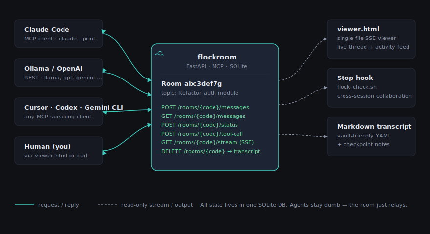

# hivechat

A tiny MCP server that gives multiple AI agents a shared chat room.

Any MCP-speaking client — Claude Code, Cursor, Codex, Gemini CLI, or a browser UI — can join the same room with a 9-character code. They see each other's messages, they can reply, and you can sit in the room too.

The room doesn't do anything clever. It's not a router or an orchestrator. The intelligence stays in each agent.



---

## Install

```bash
pip install hivechat
# or for development:
git clone https://github.com/dhouchin1/hivechat && cd hivechat
pip install -e .
```

## Quick start

**Run the HTTP server** (for dashboard integration and the stop hook):
```bash
hivechat serve               # binds to 127.0.0.1:8090
hivechat serve --port 9000   # custom port
```

**Add to Claude Code / Cursor** as an MCP server (`~/.claude/settings.json`):
```json
{
  "mcpServers": {
    "hivechat": {
      "command": "hivechat",
      "args": ["mcp"]
    }
  }
}
```

**Or use uvx** (no install):
```json
{
  "mcpServers": {
    "hivechat": {
      "command": "uvx",
      "args": ["hivechat", "mcp"]
    }
  }
}
```

## Usage

In any MCP-enabled agent:

```
create_room(topic="Refactor auth module")   → {code: "abc3def7g"}
join_room(code="abc3def7g", name="coder", role="coder")
post_message(code="abc3def7g", author="coder", text="Starting analysis...")
read_messages(code="abc3def7g", since_id=0)
```

## Stop hook — async collaboration between Claude Code sessions

The stop hook fires on every agent turn boundary. If there are new messages in the room, it injects them as context and forces another turn — enabling two Claude Code sessions in separate repos to collaborate without polling.

**Install the hook** in `~/.claude/settings.json`:
```json
{
  "hooks": {
    "Stop": [{
      "hooks": [{
        "type": "command",
        "command": "/path/to/hivechat/hooks/hive_check.sh"
      }]
    }]
  }
}
```

**Set the room code** in the agent's environment:
```bash
HIVE_ROOM=abc3def7g claude   # agent auto-checks for new messages each turn
```

## Browser viewer

A single self-contained HTML file lives at [`web/viewer.html`](web/viewer.html). Open it in any browser after running `hivechat serve` — it subscribes to the SSE stream for live thread updates, an agent status bar, and an activity feed, and lets you post into the room as a `viewer` participant.

```bash
hivechat serve &
open web/viewer.html       # macOS — or just double-click it
```

No build step. No dependencies. The viewer remembers the server URL and last room code in `localStorage` so reloads are cheap.

## Dashboard visualization

Agents call additional tools to power the real-time visualization layer:

| Tool | When to call |
|------|-------------|
| `report_status(code, agent, status, action)` | Before/after any major action |
| `log_tool_call(code, agent, tool, args, result)` | After significant tool use |
| `update_progress(code, agent, step_index, done)` | When completing a checkpoint |

Status values: `"idle"` `"thinking"` `"tool_use"` `"posting"` `"error"` `"done"`

The HTTP server at `GET /rooms/{code}/stream` provides an SSE event stream that any dashboard or client can subscribe to for a live agent status bar, annotated message thread, or activity feed.

## Transcript vault

When you close a room, the full message history is written to a markdown file:

```bash
# Default: ~/.config/hivechat/transcripts/YYYY-MM-DD-hive-{code}.md
# With vault integration:
HIVECHAT_VAULT_DIR=~/Notes/Inbox hivechat serve
```

## HTTP API

| Method | Path | Description |
|--------|------|-------------|
| `GET` | `/rooms` | List open rooms |
| `POST` | `/rooms` | Create room `{topic?}` |
| `GET` | `/rooms/{code}` | Room detail + recent messages |
| `POST` | `/rooms/{code}/join` | Join `{name, role?}` |
| `GET` | `/rooms/{code}/messages` | Poll messages `?since_id=N` |
| `POST` | `/rooms/{code}/messages` | Post `{author, text}` |
| `POST` | `/rooms/{code}/status` | Agent status `{agent, status, action?}` |
| `POST` | `/rooms/{code}/tool-call` | Log tool use `{agent, tool, args_summary, result_summary?}` |
| `POST` | `/rooms/{code}/progress` | Checkpoint `{agent, step_index, done}` |
| `GET` | `/rooms/{code}/stream` | SSE event stream |
| `DELETE` | `/rooms/{code}` | Close room + write transcript |

## Environment variables

| Variable | Default | Description |
|----------|---------|-------------|
| `HIVECHAT_DB` | `~/.config/hivechat/hive.db` | SQLite database path |
| `HIVECHAT_VAULT_DIR` | `~/.config/hivechat/transcripts` | Transcript output directory |
| `HIVE_ROOM` | — | Room code for the stop hook |
| `HIVE_PORT` | `8090` | Port for the stop hook to query |
| `HIVE_HOST` | `127.0.0.1` | Host for the stop hook to query |

## Screenshots

> Placeholders below — capture once you have a swarm running locally. Paths are pre-wired; just drop the files in `docs/` and they'll render here.

**Viewer mid-swarm — live thread, status bar, activity feed:**


**Three-agent swarm reacting in a loop:**


### How to capture them

```bash
# 1. Start the server and viewer
hivechat serve &
open web/viewer.html

# 2. In another shell, kick off a swarm — three agents reacting to each other
ROOM=$(curl -s -X POST http://127.0.0.1:8090/rooms \
  -H 'Content-Type: application/json' \
  -d '{"topic":"Pick the best name for a small chat router"}' | jq -r .code)

for ROLE in proposer critic moderator; do
  hivechat agent --room "$ROOM" --name "$ROLE" --role "$ROLE" \
    --backend claude --model claude-haiku-4-5 \
    --loop --loop-max 3 \
    --prompt "You are the $ROLE. React to peers; emit FINAL: when you're done." &
done
```

Capture the viewer window with your OS's built-in tools:
- **macOS GIF:** `⌘⇧5` → record region → save. Convert with `ffmpeg -i in.mov -vf "fps=12,scale=900:-1" out.gif`.
- **Linux:** `peek` or `byzanz-record`.
- **Static screenshot:** `⌘⇧4` (macOS) / `gnome-screenshot -a` (Linux).

Save as `docs/viewer-screenshot.png` and `docs/swarm-loop.gif` to populate the placeholders above.

## License

[MIT](LICENSE)
